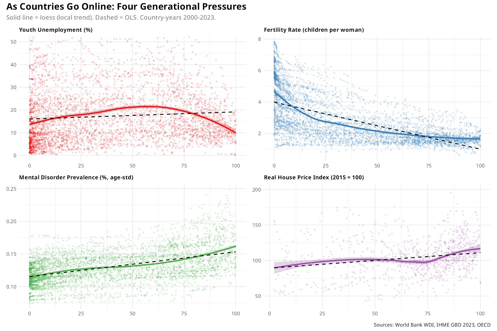

# Tech Disruption and Generational Pressures

STAT 184 final project, Section 2, Spring 2026.

**Author:** Harsh Rathi (solo).

## Question

As internet penetration rises across countries from 2000 to 2023, do we
see shifts in (a) youth unemployment, (b) fertility, (c) housing
affordability, and (d) mental disorder prevalence -- and which of those
patterns survive once we control for country and year fixed effects?

## Headline finding

The bivariate scatter says "yes" to all four: more internet, more
unemployment / less fertility / pricier housing / higher mental
disorder prevalence. Once we add log(GDP per capita), tertiary
enrollment, and urbanisation as controls, and add country and year
fixed effects, only **fertility** keeps a non-zero coefficient. The
other three patterns are largely soaked up by what is constant about
each country and what is global about each year.

See `plots/causal_nested_models.png` and the rendered report
(`report.pdf`) for details.



## Data

Country-year panel, 2000-2023. Sources:

| Source | Indicator | Variable |
|---|---|---|
| World Bank WDI | `IT.NET.USER.ZS` | Internet users (% of population) |
| World Bank WDI | `SL.UEM.1524.ZS` | Youth unemployment (15-24) |
| World Bank WDI | `SP.DYN.TFRT.IN` | Fertility rate |
| World Bank WDI | `NY.GDP.PCAP.KD`, `SE.TER.ENRR`, `SP.URB.TOTL.IN.ZS` | GDP per capita, tertiary enrollment, urbanisation (controls) |
| IHME GBD 2023 | Mental disorders, age-standardised prevalence | `mental_health` |
| OECD | Real House Price Index, 2015 = 100 | `house_price` |

All countries harmonised to ISO-3166 alpha-3 with `{countrycode}`. OECD
quarterly data aggregated to annual means.

## Repo structure

```
report.qmd               main analysis report (renders to report.pdf)
report.pdf               rendered output (submission)
PLAN.md                  PCIP plan + repo plan
refs.bib                 bibliography
apa7.csl, MLA9.csl       citation styles (APA7 used in report)
.lintr                   lintr config (BOAST / tidyverse)
linting_script.R         helper to lint everything
Project_Guidelines.md    course instructions (kept for reference)
R/
  01_acquire.R           pull WDI + OECD raw data
  02_clean_join.R        clean, ISO3-join to a country-year panel
  03_analyze_visualize.R scatter / correlation / faceted / OLS plots
  04_causal_education.R  nested regressions w/ country & year FE,
                         education channel
  run_all.R              single-file end-to-end pipeline
data/                    raw RDS files, merged CSVs
plots/                   exported PNGs of every figure
```

## Reproducing

You need R (>= 4.2) with the tidyverse, plus `WDI`, `OECD`,
`countrycode`, `ggcorrplot`, and `patchwork`. To re-pull and re-clean
the data, run:

```r
source("R/01_acquire.R")
source("R/02_clean_join.R")
source("R/04_causal_education.R")
```

To re-render the report:

```sh
quarto render report.qmd
```

The QMD reads the merged panel from `data/merged_with_controls.csv`,
which is committed to the repo, so you can render the report without
re-pulling the data.

## Plots

In `plots/`:

- `hero_visualization_v2.png` -- four-panel scatter with loess + OLS
  overlays
- `causal_nested_models.png` -- how the internet coefficient changes
  across model specs
- `correlation_heatmap.png` -- pairwise correlations across the five
  variables
- `coefficient_plot.png` -- naive OLS coefficient plot with 95% CIs
- `faceted_by_income_group.png` -- outcomes vs internet, faceted by WB
  income group
- `education_mental_health.png`, `education_fertility.png` -- faceted by
  tertiary education tier
- `scatter_internet_vs_*.png` -- per-outcome scatter plots coloured by
  continent

## Author

Harsh Rathi -- harsh@psu.edu
